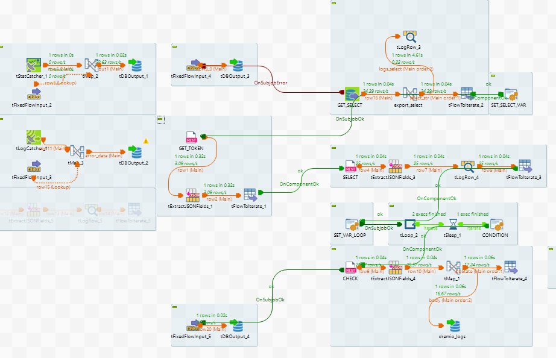

# talend-alpine
Project make image docker run talend job full load

# 1. Ý tưởng

## a. nhu cầu
Theo cách chạy bình thường thì chạy job đã thiết kế đã được biên dịch thường trú trên server range resource trước đó , mỗi lần chạy chỉ cần dùng các công cụ scheduler trigger tới các file chạy .bat .sh truyền  tham số để chạy với các cấu hình cần thiết.

Đặt ra vấn đề khi chạy job full load (dùng một job thiết kế để chạy nhiều lần với tham số truyền vào khác nhau) thì bị xảy ta trường hợp xung đột thư viện và giải pháp ta thường phải clone các job này ra nhiều thư mục và gọi ở các nơi khác nhau (simple) . 

Công ty sẵn có môi trường k8s và muốn chạy jobs tận dụng các nền tảng sẵn có để range resource , rùi ghi logs, mornitor , trigger qua airflow , theo dõi sự thay đổi bằng source code, hay version image 

## b. Giải pháp
- Container hóa để có thể chạy trên k8s, docker, phân tán chạy được ở nhiều nền tảng khác nhau.
- Đóng gói các job chạy đã biên dịch trên nền image alpine JDK 17 (talend cần môi trường linux và jdk 17 ) : viết file Dockerfile , build.sh build docker push lên registry
- Viết lại defaul file thực thi .sh để truyền context argurment từ biến ngoài vào
- Run test với docker image truyền vào argument context để kiểm tra tính đồng thời
- Nếu chạy trên k8s thì viết file deployment.yaml giới hạn resource, chạy một lần, truyền biến động context

## c. Mở rộng
- viết Dags (python) trên airflow gọi trigger truyền các biến argument của môi trường airflow UI tới các menelfit file yaml với biến

# 2. Xây dựng
## a. Build job talend fulload or incremental 
- Ta sẽ tạo chu trình kết nối tới db để get câu truy vấn đã lưu trước đó -> đây vào engin query và thực thi -> làm vòng loop để kiểm tra status của job -> complated 


## b. thay đổi file .sh
- Theo cách bình thường file chạy sh để truyền vào từ ngoài file sh (giữ nguyên mặc định )
```bash
#!/bin/sh
cd `dirname $0`
ROOT_PATH=`pwd`
java -Dtalend.component.manager.m2.repository=$ROOT_PATH/../lib ${talend.job.jvmargs} -cp ${talend.job.sh.classpath} ${talend.job.class} ${talend.job.sh.addition} "$@"3
```
run với lệnh 
```bash
 bash "/opt/job_store/dremio/DRE_FULLLOAD_STD_0.1/DRE_FULLLOAD_STD/DRE_FULLLOAD_STD_run.sh" --context_param meta_id=2 --context_param meta_qryname=DRE_ORA_DROP_OD0020 --context_param rptname=DRE1.2core_report_realiz_profit_lost_od0020_DROP
```

- Một số trường hợp đặc biệt. thay đổi seting build -> talend -> Edit project properties -> Build -> shell seting -> sh file 
```bash
#!/bin/sh
cd `dirname $0`
ROOT_PATH=`pwd`

# Giá trị mặc định cho startdate
# startdate=$(date -d "-7 days" '+%Y-%m-%d 00:00:00.000')

# Gán giá trị mặc định cho CONTEXT_PARAM với dấu ngoặc kép
# DEFAULT_CONTEXT_PARAM="--context_param startdate=\"$startdate\""
CONTEXT_PARAM=""

# Duyệt qua tất cả các tham số đầu vào
for arg in "$@"
do
  case $arg in
    --context_param*)
      CONTEXT_PARAM="$arg" # Nếu tìm thấy context_param thì ghi đè
      ;;
    *)
      ;;
  esac
done

# Kiểm tra nếu không có tham số --context_param nào thì dùng giá trị mặc định
if [ -z "$CONTEXT_PARAM" ]; then
  CONTEXT_PARAM="$DEFAULT_CONTEXT_PARAM"
fi

# Hiển thị thông tin sử dụng
echo "ETL uses context_param: $CONTEXT_PARAM"
echo "Arguments received: $@"
java -Dtalend.component.manager.m2.repository=$ROOT_PATH/../lib ${talend.job.jvmargs} -cp ${talend.job.sh.classpath} ${talend.job.class} ${talend.job.sh.addition} $CONTEXT_PARAM "$@"
```


## c. Build image 
- Đóng gói jobs đẫ build với image alpine JDK 17

```bash
cd /opt/talend-alpine
nano Dockerfile

# Sử dụng image openjdk:17-alpine
FROM openjdk:17-alpine

# Tạo thư mục làm việc trong container
WORKDIR /app

# Copy tất cả file của job Talend vào container
COPY ./DRE_FULLLOAD_STD_0.1 /app

# Show các file trong quá trình build để kiểm tra
RUN ls -lR /app

# Gán quyền thực thi cho file shell script
RUN chmod +x "/app/DRE_FULLLOAD_STD/" -R

# Lệnh mặc định để chạy job
#CMD ["/app/DRE_FULLLOAD_STD/DRE_FULLLOAD_STD_run.sh"]

# Sử dụng ENTRYPOINT để chạy script với tham số động
ENTRYPOINT ["/bin/sh", "/app/DRE_FULLLOAD_STD/DRE_FULLLOAD_STD_run.sh"]

```
chạy build ra image thường chú tại máy build
```bash
cd /opt/talend-alpine
docker build -t talend-job-dremio .
docker image ps 
```


## c. Run 
### chay voi job voi image 
```bash
docker run --rm talend-job-dremio   --context_param meta_id="1"   --context_param meta_qryname="DRE01_TEST"   --context_param rptname="DRE01_TEST_docker"
```
### Chay tren k8s
```bash
kubectl delete -n talend -f deployment.yaml
kubectl apply -n talend -f deployment.yaml
```

Note: truoc do phai tao namespace talend, sửa file deployment cho mỗi job